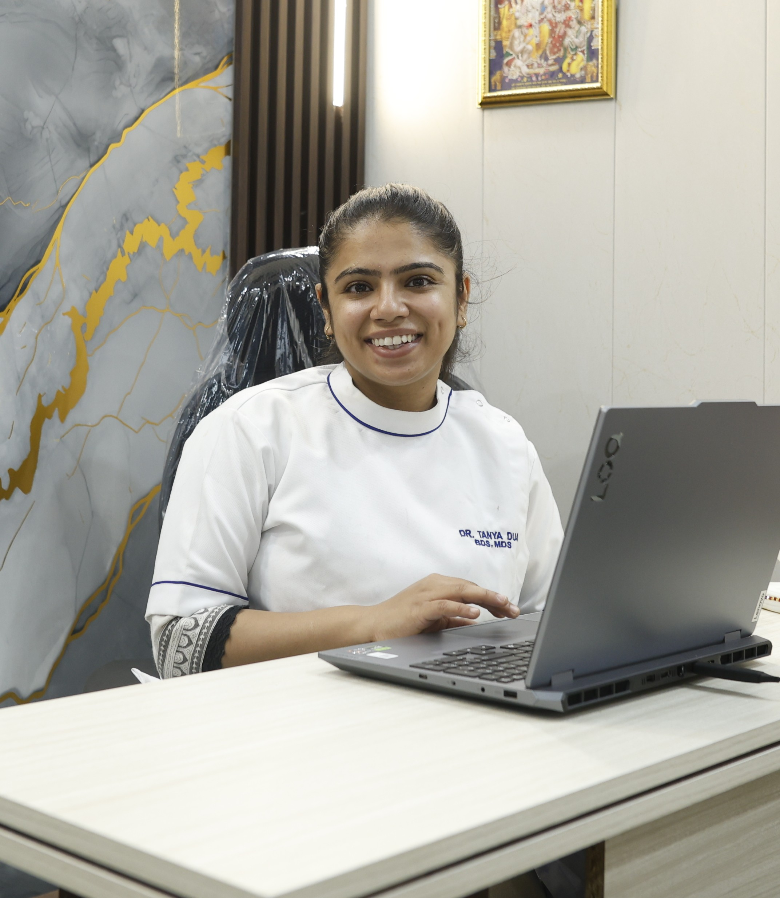

# 🌟 Tansh Dental Clinic Website  

  
  
  

---

## 🦷 About the Project  
This is my **first professional project as a developer for a client** 🚀.  
I built a **modern, responsive website** for **Tansh Dental Clinic**, designed to showcase:  
- ✅ **Services Offered**  
- ✅ **Expert Team**  
- ✅ **Patient Testimonials**  
- ✅ **Contact & Location Info**  

---

## 🎨 Features  
✨ Gradient backgrounds & smooth animations  
✨ Fully responsive (mobile & desktop)  
✨ Interactive stats counter  
✨ Modern navigation bar with mobile menu  
✨ Patient-friendly UI  

---

## 🛠️ Tech Stack  
- **HTML5**  
- **Tailwind CSS**  
- **JavaScript (Vanilla)**  
- **FontAwesome Icons**  
- **Google Fonts (Inter)**  

---

## 🚀 Deployment  
The project is deployed on **Render** and can be accessed here:  
👉 [Live Website Link](https://your-site-name.onrender.com)  

---

## 📸 Screenshots  
### 🖥️ Desktop View  
  

### 📱 Mobile View  
*(Responsive design works smoothly on all devices)*  

---

## 👨‍💻 Developer Info  
👋 Hi, I’m **Saksham Goel** – passionate about **Web Development & AI/ML**.  
This project marks the beginning of my **client-developer journey**.  

🔗 Connect with me:  
- [LinkedIn](https://www.linkedin.com/in/saksham-goel-y00528/)  
- [Instagram](https://www.instagram.com/sakshamg.06)  

---

## 📝 Note  
This is a **real-world project built for a dental clinic client**.  
It reflects my ability to work with clients, deliver professional results, and build **user-friendly digital solutions**.  

---
⭐ *First step towards my developer journey – more to come!*  
